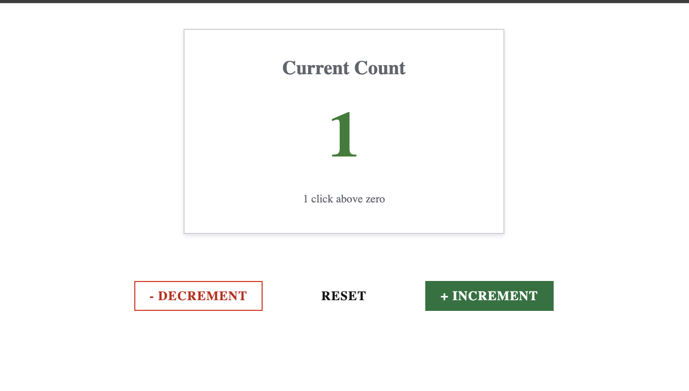

# React Global State Management Demo

[](https://github.com/YOUR_USERNAME/react-state-management/actions/workflows/deploy.yml)

**A demonstration of global state management using React Context API**

🚀 **[Live Demo](https://YOUR_USERNAME.github.io/react-state-management/)** - Try it now!

This project showcases how to implement **scalable global state management** in React applications using the **Context API** pattern. Built with TypeScript, Vite, and Salt DS, it demonstrates best practices for:

- ✨ **Global State Management** - Centralized state accessible across components
- 🎯 **React Context API** - Custom Provider/Consumer pattern implementation
- 🪝 **Custom Hooks** - Clean, reusable hooks for state and actions (`useGetCounterStore`, `useGetCounterApi`)
- 🏗️ **Separation of Concerns** - Separated state (store) and actions (API) contexts
- 📦 **Type-Safe State** - Full TypeScript support for state and actions

The demo features a **Counter Application** that illustrates:
- Real-time global state updates across components
- Context-based state management without prop drilling
- Beautiful Salt DS components for UI
- Clean architecture with custom hooks pattern

## Demo



### What This Demo Shows

This counter application demonstrates key **React Context API patterns**:

- **Provider Pattern**: `CounterStoreProvider` wraps the app to provide global state
- **Multiple Contexts**: Separate contexts for state (`CounterStoreContext`) and actions (`CounterApiContext`)
- **Custom Hooks**: 
  - `useGetCounterStore()` - Access global state from any component
  - `useGetCounterApi()` - Access state actions (increment, decrement, reset)
- **No Prop Drilling**: Components access state directly via hooks, not through props
- **Type Safety**: Full TypeScript support ensures type-safe state and actions

## Tech Stack

- **React 19.2** - UI library
- **TypeScript 5.9** - Type safety
- **Vite 7.x** - Fast build tool and dev server
- **Salt DS** - JPMorgan Chase's design system component library

## Getting Started

### Prerequisites

- Node.js (v18 or higher)
- npm or yarn

### Installation

```bash
npm install
```

### Development

Start the development server:

```bash
npm run dev
```

The application will be available at `http://localhost:5173`

### Build

Build the application for production:

```bash
npm run build
```

### Preview

Preview the production build:

```bash
npm run preview
```

### Lint

Run ESLint to check code quality:

```bash
npm run lint
```

## Project Structure

This project demonstrates a **scalable Context API architecture**:

```
├── src/
│   ├── App.tsx                          # Main app wrapped with Context Provider
│   ├── main.tsx                         # Entry point with Salt DS provider
│   ├── index.css                        # Global styles
│   └── components/
│       ├── CountDisplay/                # Consumer: Reads from global state
│       │   ├── CountDisplay.tsx         # Uses useGetCounterStore() hook
│       │   └── index.tsx
│       ├── CountController/             # Consumer: Dispatches actions
│       │   ├── CountController.tsx      # Uses useGetCounterApi() hook
│       │   └── index.tsx
│       └── CounterContext/              # 🎯 Global State Management Layer
│           ├── CounterApiContext.tsx    # Context for actions (increment, decrement, reset)
│           ├── CounterStoreContext.tsx  # Context for state (count value)
│           ├── CounterStoreProvider.tsx # Provider component wrapping the app
│           ├── use-create-counter-context.ts  # Creates state and actions
│           ├── use-get-counter-api.ts   # Hook to access actions
│           ├── use-get-counter-store.ts # Hook to access state
│           └── index.ts
├── public/                              # Static assets
├── index.html                           # HTML template
├── vite.config.ts                       # Vite configuration
└── tsconfig.json                        # TypeScript configuration
```

### Context API Architecture

This demo implements a **dual-context pattern**:

1. **CounterStoreContext** - Holds the global state (read-only)
2. **CounterApiContext** - Provides actions to modify state
3. **CounterStoreProvider** - Wraps both contexts for app-wide access
4. **Custom Hooks** - Clean API for components to consume state/actions

## Features

### Global State Management
- 🎯 **Context API Implementation** - Production-ready global state pattern
- 🔄 **Dual-Context Pattern** - Separate contexts for state and actions
- 🪝 **Custom Hooks API** - Clean `useGetCounterStore()` and `useGetCounterApi()` hooks
- 🚫 **No Prop Drilling** - Direct state access from any component
- 🏗️ **Scalable Architecture** - Easy to extend with more state and actions
- 📦 **Type-Safe** - Full TypeScript support for state and actions

### Development Features
- ⚡️ Lightning fast development with Vite HMR
- 🎨 Salt DS component library integration
- 📝 TypeScript for type safety
- 🔍 ESLint for code quality
- 💅 Prettier for consistent code formatting
- 🚀 Optimized production builds

## Counter Application Features

The demo counter application showcases **Context API patterns**:

- **State Management**: Global state using React Context API
- **Custom Hooks**: `useGetCounterStore()` and `useGetCounterApi()` for clean component architecture
- **Visual Feedback**: 
  - Green color for positive counts
  - Red color for negative counts
  - Dynamic descriptive text
- **User Actions**:
  - Increment (+1)
  - Decrement (-1)
  - Reset (back to 0)
- **Salt DS Components**:
  - `Card` for elegant container
  - `Button` with sentiment variants (positive/negative)
  - `Display1` for large typography
  - `FlowLayout` for responsive layouts

## Why This Pattern?

This demo shows how to implement **global state management without external libraries** like Redux or Zustand. The Context API pattern demonstrated here is ideal for:

- ✅ Small to medium-sized applications
- ✅ Teams that want to avoid additional dependencies
- ✅ Applications that need centralized state but don't require Redux complexity
- ✅ Learning fundamental React state management concepts
- ✅ Projects that prioritize built-in React features

## About Salt DS

Salt DS is JPMorgan Chase's open-source design system built specifically for financial applications. It provides a comprehensive set of accessible, well-tested React components that follow design best practices.

Learn more: [Salt DS Documentation](https://github.com/jpmorganchase/salt-ds)

## Deployment

This project is configured for automatic deployment to **GitHub Pages** using GitHub Actions.

### Live Demo

🚀 **[View Live Demo](https://dd-jp.github.io/react-state-management/)**

The demo is automatically deployed whenever changes are pushed to the `main` branch.

### Setting Up GitHub Pages (First Time)

1. **Push your code to GitHub**:
   ```bash
   git add .
   git commit -m "Add GitHub Pages deployment"
   git push origin main
   ```

2. **Enable GitHub Pages**:
   - Go to your repository on GitHub
   - Navigate to **Settings** → **Pages**
   - Under "Build and deployment":
     - Source: Select **"GitHub Actions"**
   - Save the settings

3. **Wait for deployment**:
   - Go to **Actions** tab in your repository
   - Watch the "Deploy to GitHub Pages" workflow run
   - Once complete, your app will be live!

4. **Update the README**:
   - Replace `YOUR_USERNAME` in the README with your actual GitHub username
   - The live demo link will be: `https://YOUR_USERNAME.github.io/react-state-management/`

### Manual Deployment

You can also trigger a manual deployment:
- Go to **Actions** tab
- Select "Deploy to GitHub Pages" workflow
- Click **"Run workflow"**

### Local Preview of Production Build

To preview the production build locally:
```bash
npm run build
npm run preview
```

## License

This project is licensed under the MIT License - see the [LICENSE](LICENSE) file for details.

